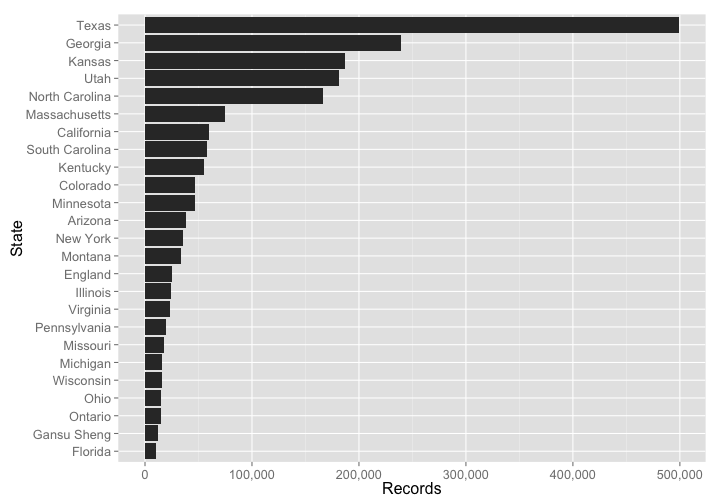

rdpla
=====


[](https://travis-ci.org/ropensci/rdpla)

`rdpla`: R client for Digital Public Library of America

Metadata from the Digital Public Library of America ([DPLA](http://dp.la/)). They have [a great API](https://github.com/dpla/platform) with good documentation - a rare thing in this world. Further documentation on their API can be found on their [search fields](http://dp.la/info/developers/codex/responses/field-reference/) and [examples of queries](http://dp.la/info/developers/codex/requests/).  Metadata schema information [here](http://dp.la/info/wp-content/uploads/2013/04/DPLA-MAP-V3.1-2.pdf).

DPLA data data can be used for a variety of use cases in various academic and 
non-academic fields. Here are some examples (vignettes to come soon showing examples): 

* Search for all photos of churches and make vizualization of 
their metadata through time
* Visualize data from individual collections - a maintainer of a collection
could gain insight from via DPLA data
* Search for all works within a spatial area, map results

## Installation

Install `rdpla` from GitHub:


```r
install.packages("devtools")
devtools::install_github("ropensci/rdpla")
```


```r
library('rdpla')
```

## Authentication

You need an API key to use the DPLA API. Use `get_key()` to request a key, which will then be emailed to you. Pass in the key in the `key` parameter in functions in this package or you can store the key in your `.Rprofile` file under the name `DPLA_API_KEY`, which will then be read in automatically.

## Search - items

> Note: limiting fields returned for readme brevity.

Basic search


```r
dpla_items(q="fruit", page_size=5, fields=c("provider","creator"))
#> $meta
#> # A tibble: 1 × 3
#>   found start returned
#>   <int> <int>    <int>
#> 1 27015     0        5
#> 
#> $data
#> # A tibble: 5 × 2
#>                        provider                         creator
#>                           <chr>                           <chr>
#> 1 Mountain West Digital Library                      no content
#> 2 Mountain West Digital Library                      no content
#> 3 Mountain West Digital Library                      no content
#> 4   The New York Public Library Anderson, Alexander (1775-1870)
#> 5   The New York Public Library Anderson, Alexander (1775-1870)
#> 
#> $facets
#> list()
```

Limit fields returned


```r
dpla_items(q="fruit", page_size = 10, fields=c("publisher","format"))
#> $meta
#> # A tibble: 1 × 3
#>   found start returned
#>   <int> <int>    <int>
#> 1 27015     0       10
#> 
#> $data
#> # A tibble: 10 × 2
#>        format  publisher
#>         <chr>      <chr>
#> 1  no content no content
#> 2  no content no content
#> 3  no content no content
#> 4  no content no content
#> 5  no content no content
#> 6  no content no content
#> 7  no content no content
#> 8  no content no content
#> 9  no content no content
#> 10 no content no content
#> 
#> $facets
#> list()
```

Limit records returned


```r
dpla_items(q="fruit", page_size=2, fields=c("provider","title"))
#> $meta
#> # A tibble: 1 × 3
#>   found start returned
#>   <int> <int>    <int>
#> 1 27015     0        2
#> 
#> $data
#> # A tibble: 2 × 2
#>   title                      provider
#>   <chr>                         <chr>
#> 1 Fruit Mountain West Digital Library
#> 2 Fruit Mountain West Digital Library
#> 
#> $facets
#> list()
```

Search by date


```r
dpla_items(q="science", date_before=1900, page_size=10, fields=c("id","date"))
#> $meta
#> # A tibble: 1 × 3
#>   found start returned
#>   <int> <int>    <int>
#> 1 50830     0       10
#> 
#> $data
#> # A tibble: 10 × 2
#>                                  id      date
#>                               <chr>     <chr>
#> 1  7a8afa97e5805d66ab044e6a71d70b5f      1851
#> 2  8b2dba3d4947cc97de111425cd43d3e6     1883-
#> 3  855407956475c37b086fa7603aa29038      1880
#> 4  e7c3b499f627d21910b4ebb4282f0bdc      1880
#> 5  afbea811bc274aac4a049828941c86e9      1880
#> 6  4786d787da0ac9f126e5daf9a32f16b7      1886
#> 7  9f79e6f53dfd2f31a17d756a90f22e0b      1883
#> 8  bf656dc0ab243d29eba122387fbc0950 1881-1882
#> 9  3bc189a6c3061bd9c2005e67150d4b5a      1880
#> 10 2289f4cbee338d3ee22472084399d0c1     1880-
#> 
#> $facets
#> list()
```

Search on specific fields


```r
dpla_items(description="obituaries", page_size=2, fields="description")
#> $meta
#> # A tibble: 1 × 3
#>   found start returned
#>   <int> <int>    <int>
#> 1 50660     0        2
#> 
#> $data
#> # A tibble: 2 × 1
#>                          description
#>                                <chr>
#> 1              Obituaries of members
#> 2 Pages from the complied obituaries
#> 
#> $facets
#> list()
```


```r
dpla_items(subject="yodeling", page_size=2, fields="subject")
#> $meta
#> # A tibble: 1 × 3
#>   found start returned
#>   <int> <int>    <int>
#> 1    51     0        2
#> 
#> $data
#> # A tibble: 2 × 1
#>                                                     subject
#>                                                       <chr>
#> 1 Yodeling--Austria;Musicians--Austria;Restaurants--Austria
#> 2  Yodeling--Austria;Musicians--Austria;Gamehouses--Austria
#> 
#> $facets
#> list()
```


```r
dpla_items(provider="HathiTrust", page_size=2, fields="provider")
#> $meta
#> # A tibble: 1 × 3
#>     found start returned
#>     <int> <int>    <int>
#> 1 2566670     0        2
#> 
#> $data
#> # A tibble: 2 × 1
#>     provider
#>        <chr>
#> 1 HathiTrust
#> 2 HathiTrust
#> 
#> $facets
#> list()
```

Spatial search, across all spatial fields


```r
dpla_items(sp='Boston', page_size=2, fields=c("id","provider"))
#> $meta
#> # A tibble: 1 × 3
#>   found start returned
#>   <int> <int>    <int>
#> 1 75966     0        2
#> 
#> $data
#> # A tibble: 2 × 2
#>                                 id                provider
#>                              <chr>                   <chr>
#> 1 c6791046ceb3a0425f78a083a5370a13 Smithsonian Institution
#> 2 1542004b196587885a5150650a5451ec Smithsonian Institution
#> 
#> $facets
#> list()
```

Spatial search, by states


```r
dpla_items(sp_state='Massachusetts OR Hawaii', page_size=2, fields=c("id","provider"))
#> $meta
#> # A tibble: 1 × 3
#>    found start returned
#>    <int> <int>    <int>
#> 1 182228     0        2
#> 
#> $data
#> # A tibble: 2 × 2
#>                                 id
#>                              <chr>
#> 1 b6f7914260c69876dd81037d353cdcc2
#> 2 97feb7d7f98eb76c6713a6435ab9a0cd
#> # ... with 1 more variables: provider <chr>
#> 
#> $facets
#> list()
```

Faceted search


```r
dpla_items(facets=c("sourceResource.spatial.state","sourceResource.spatial.country"),
      page_size=0, facet_size=5)
#> $meta
#> # A tibble: 1 × 3
#>      found start returned
#>      <int> <int>    <int>
#> 1 13997962     0        0
#> 
#> $data
#> # A tibble: 0 × 0
#> 
#> $facets
#> $facets$sourceResource.spatial.state
#> $facets$sourceResource.spatial.state$meta
#> # A tibble: 1 × 4
#>    type   total  missing   other
#>   <chr>   <int>    <int>   <int>
#> 1 terms 4014977 10438104 2211661
#> 
#> $facets$sourceResource.spatial.state$data
#> # A tibble: 5 × 2
#>            term  count
#>           <chr>  <int>
#> 1         Texas 758429
#> 2       Georgia 371966
#> 3    California 265226
#> 4          Utah 231129
#> 5 Massachusetts 176566
#> 
#> 
#> $facets$sourceResource.spatial.country
#> $facets$sourceResource.spatial.country$meta
#> # A tibble: 1 × 4
#>    type   total missing  other
#>   <chr>   <int>   <int>  <int>
#> 1 terms 4609034 9633049 793115
#> 
#> $facets$sourceResource.spatial.country$data
#> # A tibble: 5 × 2
#>             term   count
#>            <chr>   <int>
#> 1  United States 3523179
#> 2 United Kingdom   97742
#> 3         France   91655
#> 4         Canada   67781
#> 5        Germany   35562
```

## Search - collections

Search for collections with the words _university of texas_


```r
dpla_collections(q="university of texas", page_size=2)
#> $meta
#> # A tibble: 1 × 2
#>   found returned
#>   <int>    <int>
#> 1    18        2
#> 
#> $data
#> # A tibble: 2 × 14
#>                                `_rev`                  ingestDate
#>                                 <chr>                       <chr>
#> 1 10-01d4520a193dc80b47edff4d0c033690 2016-07-11T17:22:44.544050Z
#> 2 10-527c98617e8154a1c9432630753b9f1f 2016-07-11T17:22:43.760797Z
#> # ... with 12 more variables: `@context` <chr>, id <chr>, title <chr>,
#> #   `_id` <chr>, description <chr>, `@type` <chr>, ingestType <chr>,
#> #   `@id` <chr>, ingestionSequence <int>, score <dbl>,
#> #   validation_message <lgl>, valid_after_enrich <lgl>
```

You can also search in the `title` and `description` fields


```r
dpla_collections(description="east")
#> $meta
#> # A tibble: 1 × 2
#>   found returned
#>   <int>    <int>
#> 1     5       10
#> 
#> $data
#> # A tibble: 5 × 14
#>                                `_rev`                  ingestDate
#>                                 <chr>                       <chr>
#> 1  5-cd3f6c8bdfd6d52df90e0b4947f6e184 2016-07-04T10:13:47.925456Z
#> 2  1-6c9ffe63d5739ac9080ea6f600b936b8 2015-06-15T14:32:25.193810Z
#> 3  1-e4c48d52be7a39ae78761b396474d050 2015-06-15T14:32:25.102718Z
#> 4 10-14e0edd98d84aab42f6732f8061f757b 2016-07-12T22:43:55.947277Z
#> 5  1-b1047ac66e6f434048347fdacbf2f4af 2015-06-15T14:32:25.384537Z
#> # ... with 12 more variables: `@context` <chr>, id <chr>, title <chr>,
#> #   `_id` <chr>, description <chr>, `@type` <chr>, ingestType <chr>,
#> #   `@id` <chr>, ingestionSequence <int>, score <dbl>,
#> #   validation_message <lgl>, valid_after_enrich <lgl>
```

## Visualize

Visualize metadata from the DPLA - histogram of number of records per state (includes __states__ outside the US)


```r
out <- dpla_items(facets="sourceResource.spatial.state", page_size=0, facet_size=25)
library("ggplot2")
library("scales")
ggplot(out$facets$sourceResource.spatial.state$data, aes(reorder(term, count), count)) +
  geom_bar(stat="identity") +
  coord_flip() +
  theme_grey(base_size = 16) +
  scale_y_continuous(labels = comma) +
  labs(x="State", y="Records")
```



## Meta

* Please [report any issues or bugs](https://github.com/ropensci/rdpla/issues).
* License: MIT
* Get citation information for `rdpla` in R doing `citation(package = 'rdpla')`
* Please note that this project is released with a [Contributor Code of Conduct](CONDUCT.md). By participating in this project you agree to abide by its terms.

[](http://ropensci.org)
