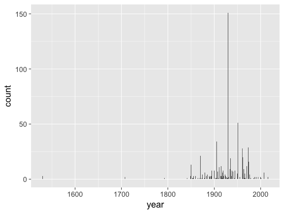
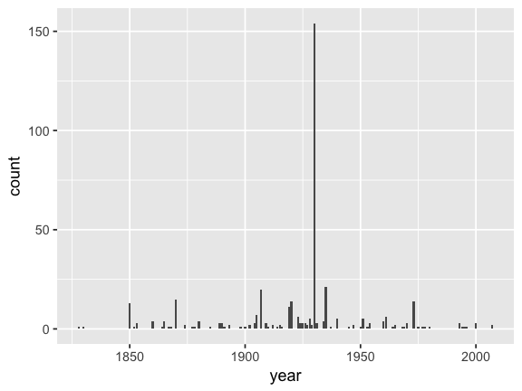

%\VignetteEngine{knitr::knitr}
%\VignetteIndexEntry{Introduction to rdpla}
%\VignetteEncoding{UTF-8}

-   [Get item data](#get-item-data)
-   [Parse data](#parse-data)
-   [Vizualize](#vizualize)

To aid users in what can be done with `rdpla`, the following is one
example.

Use case:

> Search for all photos of churches and make a visualization through
> time and facet by other factors

Get item data
-------------

    library("rdpla")
    library("data.table")
    library("lubridate")

To get all data for `subject:churches` and of `type=image` we'd need to
do about 100 requests of size 500 records, but we'll just do one that so
the example runs quickly.

    res <- dpla_items(subject = "churches", type = "image", page_size = 500)
    df <- res$data

Parse data
----------

    dates <- unlist(df$date, use.names = FALSE)
    # remove 2nd part of a duration separted by " - ", just use first date
    dates <- gsub("\\s-\\s.+", "", dates)
    # remove 2nd part of a duration separted by "/", just use first date
    dates <- gsub("/.+", "", dates)
    # remove 2nd part of a duration separted by "-", just use first date
    dates <- gsub("-[0-9]{4}", "", dates)
    # remove any text, can't parse it
    dates <- gsub("[[:alpha:]]+", "", dates)
    # trim leading and trailing white space
    dates <- gsub("^\\s+|\\s+$", "", dates)
    # parse dates
    df$date_corr <- parse_date_time(dates, c("Y", "ymd", "ym", "%Y-%m-%d%H:%M:%S%z"))

Make year column

    df$year <- year(df$date_corr)

Summarize by year

    df_dt <- as.data.table(df)
    df_dt <- df_dt[order(year)]
    df_sum <- df_dt[, list(count = length(id)), by = year]
    df_sum <- as.data.frame(na.omit(df_sum))

Vizualize
---------

    library("ggplot2")

    ggplot(df_sum, aes(x = year, y = count)) + 
      geom_bar(stat = "identity") + 
      theme_gray(base_size = 18)

Zooming in on the majority of the data

    ggplot(subset(df_sum, year > 1800), aes(x = year, y = count)) + 
      geom_bar(stat = "identity") + 
      theme_gray(base_size = 18)

Looks like there's a big spike in 1930

Let's have a look at a few of the titles

    sort(unique(subset(df, year == 1930)$title))[1:10]
    #>  [1] "Associated Reformed Presbyterian Church, Chester, S. C"                                
    #>  [2] "Bethlehem Lutheran Church, U. A. C., 3705 South Anthony Boulevard, Fort Wayne, Indiana"
    #>  [3] "Blandford Church, Petersburg, Va., interior of Blandford Church"                       
    #>  [4] "Blessed Sacrament Church, Bolton Landing, N. Y"                                        
    #>  [5] "Blessed Sacrament Church, Holyoke, Mass"                                               
    #>  [6] "Broad Street Methodist Episcopal Church, south, Richmond, VA"                          
    #>  [7] "Bryan Memorial Church, Miami, Florida"                                                 
    #>  [8] "Cathedral of San Francisco de Assisi, Santa Fe, New Mexico"                            
    #>  [9] "Cathedral of St. John--The Baptist, Charleston, S. C"                                  
    #> [10] "Cathedral of the Holy Spirit, Bismarck, N. Dak"
